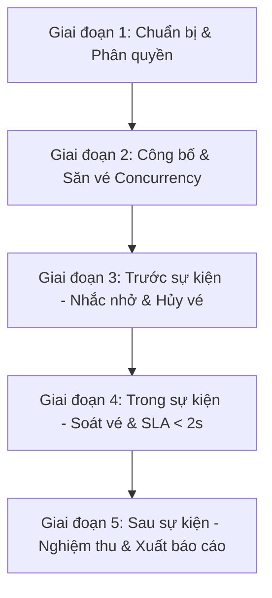

# KẾ HOẠCH KIỂM THỬ TOÀN DIỆN (END-TO-END TEST PLAN)
## DỰ ÁN: HỆ THỐNG QUẢN LÝ SỰ KIỆN VÀ ĐIỂM DANH QR (CAMPUSEVENTHUB)

---

### THÔNG TIN TÀI LIỆU (DOCUMENT INFORMATION)

| Thuộc tính | Chi tiết |
| :--- | :--- |
| **Dự án** | CampusEventHub |
| **Tài liệu** | Master End-to-End Test Plan (Kế hoạch kiểm thử đầu-cuối) |
| **Phiên bản** | 1.0.0 |
| **Trạng thái** | Phê duyệt thực thi (Approved for Execution) |
| **Ngày lập** | 2026-10-06 |
| **Tài liệu tham chiếu** | [BA_ACCEPTANCE_CRITERIA.md](./BA_ACCEPTANCE_CRITERIA.md), SRS, Database Schema |

---

## 1. MỤC TIÊU VÀ PHẠM VI KIỂM THỬ (GOALS & SCOPE)

### 1.1 Mục tiêu (Goals)
1. Xác minh toàn bộ các luồng nghiệp vụ liên hoàn xuyên suốt từ giao diện người dùng (UI), qua tầng xử lý nghiệp vụ (Backend API), đến cơ sở dữ liệu (Supabase PostgreSQL / RPC Stored Functions).
2. Đảm bảo tính toàn vẹn của dữ liệu trong các tình huống nhạy cảm: **Săn vé đồng thời (Race condition/Capacity lock)** và **Soát vé thời gian thực (SLA $\le 2.0$ giây)**.
3. Đảm bảo hệ thống đạt đầy đủ các Tiêu chí chấp nhận (Acceptance Criteria) đã định nghĩa trong tài liệu BA trước khi đưa vào nghiệm thu thực tế.

### 1.2 Phạm vi kiểm thử (Scope)
* **Trong phạm vi (In-Scope):**
  * Luồng Xác thực, Phân quyền (RBAC) & Hồ sơ cá nhân.
  * Vòng đời quản lý sự kiện (Tạo mới, giới hạn Capacity, chỉnh sửa, gán nhân viên).
  * Luồng Khám phá, Tìm kiếm/Lọc & Đăng ký vé của Sinh viên.
  * Cơ chế sinh mã QR bảo mật HMAC-SHA256 & Gửi email xác nhận.
  * Quản lý vé cá nhân, phân nhóm Sắp tới/Lịch sử & Luồng Hủy vé trước giờ G.
  * Bộ máy soát vé (Check-in Engine) qua Camera & Nhập thủ công (Happy path, Duplicate check-in, Unhappy paths).
  * Dashboard thống kê số liệu và xuất danh sách người tham gia (Excel/CSV).
  * Tác vụ nền (Cron job gửi email nhắc nhở trước 24 giờ).
* **Ngoài phạm vi (Out-of-Scope):**
  * Tích hợp cổng thanh toán trực tuyến (Dự án phục vụ sự kiện nội bộ miễn phí vé).
  * Kiểm thử phần cứng quét mã laser chuyên dụng (Hệ thống tập trung vào Camera điện thoại/Laptop).

---

## 2. CHIẾN LƯỢC KIỂM THỬ ĐA TẦNG (TESTING STRATEGY & PYRAMID)

Kế hoạch kiểm thử E2E của dự án kết hợp hài hòa giữa **Tự động hóa (Automation)** và **Thủ công (Manual)** theo 4 tầng kiểm thử:

```
        /  Tầng 4: Manual & Exploratory Test  \  --> Camera thực tế, UI UX, Font Excel
       /   Tầng 3: Concurrency & Performance   \  --> k6 (Săn vé 50 reqs, Đo SLA < 2s)
      /    Tầng 2: Frontend E2E UI Automation   \  --> Playwright (Multi-role UI flows)
     /      Tầng 1: Backend API Integration      \  --> Jest + Supertest (Chaining API)
```

1. **Tầng 1 - API Integration Testing (Jest + Supertest):** Kiểm tra tính toàn vẹn của chuỗi API (Chaining calls) trong Backend mà không cần mở trình duyệt. Phủ 100% các rẽ nhánh logic nghiệp vụ và mã lỗi.
2. **Tầng 2 - UI End-to-End Automation (Playwright):** Giả lập hành vi thực tế của người dùng trên trình duyệt (Chromium, Firefox, WebKit), kiểm tra tương tác đa vai trò (Multi-role context song song).
3. **Tầng 3 - Concurrency & Performance Benchmark (k6):** Kiểm tra giới hạn chịu tải, kiểm tra cơ chế khóa bi quan (Pessimistic Lock) khi nhiều người săn vé cùng lúc và đo thời gian phản hồi API Check-in.
4. **Tầng 4 - Manual, Usability & Exploratory Testing:** Đánh giá trải nghiệm thực tế trên thiết bị di động, camera thực tế với điều kiện ánh sáng yếu, kiểm tra hiển thị email trên các app mail (Gmail/Outlook) và định dạng file Excel.

---

## 3. MÔI TRƯỜNG VÀ DỮ LIỆU KIỂM THỬ (TEST ENVIRONMENT & DATA SETUP)

| Thành phần | Cấu hình kiểm thử | Ghi chú quản lý |
| :--- | :--- | :--- |
| **Backend** | `http://localhost:5000` (Node.js 22 + Express 5) | Chạy chế độ test, kết nối test schema |
| **Frontend** | `http://localhost:5173` (React 19 + Vite) | Chạy dev server phục vụ Playwright |
| **Cơ sở dữ liệu** | Supabase PostgreSQL + Migration Scripts | Sử dụng RPC functions `dat_ve_su_kien`, `check_in_ticket`, `cancel_ticket` |
| **Dịch vụ Email** | Ethereal Email / Mailpit (Local SMTP) | Bắt trọn 100% email gửi đi, không gửi ra ngoài môi trường thật |
| **Data Isolation** | Chiến lược Fixtures & Clean Teardown | Mỗi kịch bản tự sinh dữ liệu tiền tố `test_e2e_[timestamp]` và tự dọn dẹp sau khi chạy |

---

## 4. LUỒNG KIỂM THỬ E2E CHUẨN CHỈNH (END-TO-END BUSINESS WORKFLOWS)

Quy trình kiểm thử E2E được tổ chức thành **5 giai đoạn liên hoàn (5 Phases)** mô phỏng đúng chu kỳ sống của một sự kiện trong thực tế:



### Giai đoạn 1: Chuẩn bị & Phân quyền (Organizer Event Setup)
* **Luồng thực thi:**
  1. Người tổ chức (`ToChuc`) đăng nhập hệ thống $\to$ Điều hướng tới màn hình Quản lý sự kiện.
  2. Tạo sự kiện mới với `capacity = 2` (phục vụ test kịch bản cháy vé), cấu hình ngày bắt đầu/kết thúc hợp lệ.
  3. Tìm kiếm sinh viên theo MSSV và gán quyền làm Nhân viên soát vé (`NhanVienCheckIn`) cho sự kiện.
  4. Xác minh nhân viên soát vé thấy sự kiện xuất hiện trong danh sách "Sự kiện phụ trách".

### Giai đoạn 2: Công bố & Săn vé đồng thời (Discovery & Concurrency Booking)
* **Luồng thực thi:**
  1. Sinh viên A, B, C mở trang chủ $\to$ Dùng bộ lọc chủ đề và tìm kiếm sự kiện vừa tạo.
  2. Xem trang chi tiết sự kiện $\to$ Kiểm tra số lượng vé khả dụng ban đầu (`so_luong_con_lai = 2`).
  3. **Kiểm tra Concurrency (Race condition):** Giả lập Sinh viên A, B và C cùng bấm nút "Đăng ký" trong cùng 1 thời điểm:
     * Sinh viên A và B: Đăng ký thành công $\to$ Sinh mã QR HMAC-SHA256 $\to$ Nhận email xác nhận $\to$ `so_luong_con_lai` giảm về `0`.
     * Sinh viên C: Nhận thông báo "Sự kiện đã hết chỗ" $\to$ Nút đăng ký chuyển thành "Hết vé".
     * Xác minh trong Database: `so_luong_con_lai = 0` (tuyệt đối không bị âm).
  4. Sinh viên A truy cập lại sự kiện $\to$ Hệ thống nhận diện đã có vé, nút đổi thành "Bạn đã đăng ký sự kiện này".

### Giai đoạn 3: Trước sự kiện - Nhắc nhở & Hủy vé (Pre-Event Lifecycle)
* **Luồng thực thi:**
  1. Sinh viên B có lịch bận đột xuất $\to$ Vào trang "Vé của tôi" (Tab Sắp diễn ra).
  2. Bấm "Hủy vé" và xác nhận $\to$ Trạng thái vé chuyển thành `DaHuy`, mã QR bị vô hiệu hóa.
  3. Hệ thống hoàn lại 1 slot trống cho sự kiện (`so_luong_con_lai` tăng từ `0` lên `1`).
  4. Sinh viên C đăng ký lại $\to$ Giờ đây đăng ký thành công lấy slot vừa được hoàn trả.
  5. Kích hoạt Background Job (`reminder.job.js`) $\to$ Hệ thống quét và gửi email nhắc nhở tự động cho Sinh viên A và C trước 24 giờ.

### Giai đoạn 4: Trong sự kiện - Soát vé & Kiểm chứng SLA < 2s (Event Check-in Engine)
* **Luồng thực thi:**
  1. Nhân viên soát vé đăng nhập $\to$ Chọn sự kiện đang diễn ra.
  2. **Happy Path (SLA < 2s):** Quét mã QR của Sinh viên A (hoặc nhập mã thủ công) $\to$ Hệ thống đổi trạng thái thành `DaCheckIn`, hiển thị Họ tên, MSSV, Khoa của Sinh viên A. **Đo thời gian phản hồi: hoàn tất trong $\le 2.0$ giây**.
  3. **Duplicate Check-in (Quét trùng):** Quét lại mã vé của Sinh viên A lần 2 $\to$ Lập tức cảnh báo đỏ: "Vé đã được check-in trước đó lúc [hh:mm:ss]" và từ chối.
  4. **Wrong Event:** Dùng vé của sự kiện khác quét vào $\to$ Báo lỗi `WRONG_EVENT`.
  5. **Cancelled Ticket:** Dùng mã QR cũ của Sinh viên B (đã hủy) đem quét $\to$ Báo lỗi `TICKET_CANCELLED`.

### Giai đoạn 5: Sau sự kiện - Nghiệm thu, Thống kê & Báo cáo (Post-Event & Analytics)
* **Luồng thực thi:**
  1. Người tổ chức mở Dashboard thống kê $\to$ Kiểm tra các chỉ số:
     * Tổng số vé: 2.
     * Số người đăng ký: 2 (Sinh viên A & C).
     * Số người thực tế tham gia: 1 (Sinh viên A).
     * Tỷ lệ tham dự thực tế: $50\%$.
  2. Người tổ chức vào Danh sách người tham gia $\to$ Đổi trạng thái thủ công cho Sinh viên C sang `DaCheckIn` (trường hợp quên điện thoại).
  3. Xuất báo cáo danh sách ra file Excel (`.xlsx`) $\to$ Kiểm tra file tải về có đầy đủ thông tin, cột chuẩn, hiển thị tiếng Việt UTF-8 chính xác.

---

## 5. MA TRẬN KỊCH BẢN KIỂM THỬ CHI TIẾT (E2E TEST SCENARIOS MATRIX)

| Mã Test Case | Tên kịch bản (Scenario) | Các bước thực hiện chính (Execution Steps) | Kết quả mong đợi (Expected Results) | Hình thức kiểm thử |
| :--- | :--- | :--- | :--- | :---: |
| **TC-E2E-01** | Tạo sự kiện & Ràng buộc Capacity | 1. Organizer login<br>2. Nhập thông tin sự kiện với `capacity = 2`<br>3. Submit form | Sự kiện tạo thành công với trạng thái `SapToChuc`, `so_luong_con_lai = 2`. | **Automation (Playwright / API)** |
| **TC-E2E-02** | Phân quyền Nhân viên Check-in | 1. Organizer tìm kiếm SV theo MSSV<br>2. Gán vào sự kiện<br>3. Staff login | Staff thấy sự kiện trong danh sách được phân công. | **Automation (Playwright / API)** |
| **TC-E2E-03** | Tìm kiếm & Lọc sự kiện đa tiêu chí | 1. Student vào trang chủ<br>2. Lọc theo chủ đề & trạng thái "Còn chỗ" | Danh sách cập nhật tức thì, hiển thị đúng sự kiện vừa tạo. | **Automation (Playwright)** |
| **TC-E2E-04** | **Săn vé đồng thời (Race Condition)** | 1. Bắn đồng thời 50 request đăng ký cho sự kiện chỉ còn 2 vé | • Đúng 2 request thành công (`200 OK`)<br>• 48 request trả về hết chỗ<br>• `so_luong_con_lai` bằng đúng 0. | **Automation (k6 / Concurrency Script)** |
| **TC-E2E-05** | Nhận vé & Sinh mã QR HMAC-SHA256 | 1. Student đăng ký thành công<br>2. Kiểm tra mã QR trên UI và trong DB | Mã QR được mã hóa HMAC-SHA256 chuẩn xác, email xác nhận được gửi đi. | **Automation (Supertest + Jest)** |
| **TC-E2E-06** | Chặn đăng ký trùng lặp | 1. Student đã có vé cố tình gọi API đăng ký lại sự kiện đó | Trả về mã lỗi `400 Bad Request` ("Mỗi sinh viên chỉ được đăng ký một vé"). | **Automation (Supertest)** |
| **TC-E2E-07** | Hủy vé hoàn trả slot trống | 1. Student chọn Hủy vé trước giờ bắt đầu<br>2. Kiểm tra sự kiện | Vé chuyển thành `DaHuy`, `so_luong_con_lai` tăng lại 1 slot. | **Automation (Playwright / API)** |
| **TC-E2E-08** | **Soát vé Check-in & SLA < 2.0s** | 1. Staff chọn sự kiện<br>2. Quét mã QR của Student<br>3. Bấm xác nhận | • Đổi trạng thái vé sang `DaCheckIn`<br>• Trả về thông tin sinh viên<br>• **Thời gian xử lý $\le 2.0$ giây**. | **Automation (Playwright Benchmark)** |
| **TC-E2E-09** | Chặn Check-in trùng lặp lần 2 | 1. Quét lại mã vé vừa check-in ở bước TC-E2E-08 | Hệ thống cảnh báo đỏ `ALREADY_CHECKED_IN`, hiển thị thời gian check-in cũ. | **Automation (Supertest / Playwright)** |
| **TC-E2E-10** | Từ chối vé không hợp lệ | 1. Quét vé sai sự kiện<br>2. Quét vé đã hủy<br>3. Quét chuỗi ngẫu nhiên | Báo lỗi tương ứng: `WRONG_EVENT`, `TICKET_CANCELLED`, `INVALID_TICKET`. | **Automation (Supertest)** |
| **TC-E2E-11** | Kiểm tra Cron Job nhắc nhở 24h | 1. Mock thời gian hệ thống trước giờ sự kiện 24h<br>2. Kích hoạt reminder job | Gửi email nhắc nhở kèm mã QR cho các sinh viên có vé hợp lệ. | **Automation (Jest Test Job)** |
| **TC-E2E-12** | Dashboard thống kê số liệu | 1. Organizer vào trang Dashboard | Hiển thị biểu đồ và tỷ lệ lấp đầy, tỷ lệ check-in chính xác theo số liệu thực tế. | **Automation (Playwright UI)** |
| **TC-E2E-13** | Xuất báo cáo danh sách Excel | 1. Organizer bấm "Xuất Excel"<br>2. Tải file về | File `.xlsx` chứa đầy đủ các cột dữ liệu, không lỗi font tiếng Việt UTF-8. | **Automation (Buffer verify) + Manual** |
| **TC-E2E-14** | Trải nghiệm quét Camera thực tế | 1. Dùng điện thoại thật quét mã QR trên màn hình laptop trong điều kiện phòng tối/nghiêng | Camera nhận diện mã mượt mà trong vòng dưới 1 giây. | **Manual Testing** |
| **TC-E2E-15** | Kiểm tra Responsive Mobile | 1. Mở màn hình Staff & Ticket trên màn hình 375px (iPhone) | Giao diện hiển thị rõ ràng, nút bấm to dễ thao tác, không vỡ layout khi bật bàn phím. | **Manual Testing** |

---

## 6. TIÊU CHÍ BẮT ĐẦU VÀ KẾT THÚC (ENTRY & EXIT CRITERIA)

### 6.1 Tiêu chí Bắt đầu (Entry Criteria)
* Toàn bộ mã nguồn mới nhất trên nhánh `main` đã được kéo về (`git pull`) và build không có lỗi cú pháp.
* Database Supabase đã chạy đầy đủ các migration scripts và Stored Procedures (`dat_ve_su_kien`, `check_in_ticket`, `cancel_ticket`).
* Cả 2 server Backend (`localhost:5000`) và Frontend (`localhost:5173`) đang hoạt động bình thường.
* Bộ biến môi trường `.env` ở cả hai phía đã được cấu hình đầy đủ.

### 6.2 Tiêu chí Kết thúc & Nghiệm thu (Exit Criteria)
* **100% các Test Case mức P0 (Critical)** phải đạt trạng thái **PASS** (Bao gồm: Săn vé không âm capacity, Cấp mã QR, Check-in chuẩn xác, Chặn quét trùng, Phân quyền RBAC).
* **0 lỗi nghiêm trọng (Blocker / Critical defects)** còn tồn đọng.
* Benchmark thời gian xử lý Check-in trung bình đạt **$\le 1.5$ giây** (Vượt tiêu chuẩn yêu cầu $\le 2.0$ giây).
* Các kịch bản Manual (Quét camera điện thoại thực tế, giao diện responsive, file Excel xuất ra) đều được nghiệm thu trực quan đạt chuẩn.

---

## 7. QUẢN LÝ LỖI VÀ BÁO CÁO (DEFECT MANAGEMENT & REPORTING)

### 7.1 Phân cấp mức độ lỗi (Severity Levels)
* **P0 - Blocker / Critical:** Lỗi làm sập server, âm số lượng vé khi săn vé, lộ dữ liệu nhạy cảm, chức năng check-in không hoạt động.
* **P1 - Major:** Lỗi logic nghiệp vụ quan trọng (ví dụ: hủy vé nhưng không hoàn slot, không xuất được file Excel, gửi sai nội dung email).
* **P2 - Minor / Cosmetic:** Lỗi giao diện nhỏ, canh lề lệch trên mobile, thông báo lỗi chưa chuẩn ngữ pháp tiếng Việt.

### 7.2 Định dạng báo cáo kiểm thử (Deliverables)
1. **Playwright HTML Test Report:** Báo cáo chi tiết từng bước click, screenshot và video quay lại thao tác trình duyệt.
2. **Jest Test Summary:** Tỷ lệ Pass/Fail và thời gian thực thi của các test API integration.
3. **k6 Metrics Report:** Biểu đồ độ trễ (latency $p_{95}, p_{99}$), số lượng request/giây và tỷ lệ thành công của luồng Concurrency.
4. **Báo cáo tổng kết nghiệm thu QA/BA:** Bản tóm tắt dành cho báo cáo môn học / đồ án.

---

## 8. LỘ TRÌNH THỰC HIỆN (EXECUTION ROADMAP)

```
Tuần / Giai đoạn ───────────────>
[Phase 1: Setup Môi trường & Test Fixtures]  ==> Đã sẵn sàng
[Phase 2: Triển khai Backend Integration Test] ==> Ưu tiên số 1 (Chạy ngay)
[Phase 3: Triển khai Concurrency Test (k6)]    ==> Kiểm tra Capacity
[Phase 4: Triển khai Frontend E2E (Playwright)] ==> Tự động hóa UI
[Phase 5: Kiểm thử Thủ công (Camera/Mobile)]   ==> Nghiệm thu thực tế
[Phase 6: Đóng gói Báo cáo QA & BA]           ==> Hoàn tất dự án
```
