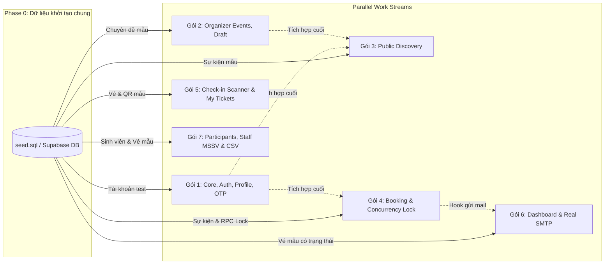

# KẾ HOẠCH PHÂN CHIA GÓI CÔNG VIỆC BACKEND & TÍCH HỢP FRONTEND

## DỰ ÁN: CAMPUS EVENT HUB (IS207 - UIT)

> **Mô hình triển khai:** Full-Stack Slice (Mỗi lập trình viên phụ trách trọn vẹn từ việc xây dựng Backend API, Controller, Service, kết nối Database Supabase cho đến việc trực tiếp tích hợp, thay thế dữ liệu Mock bằng dữ liệu thật trên các trang Frontend tương ứng).

---

## I. NGUYÊN TẮC THIẾT KẾ & CHIẾN LƯỢC THỰC THI SONG SONG (PARALLEL EXECUTION)

1. **Phạm vi khép kín (End-to-End):** Không tách rời người làm API và người ghép giao diện. Thành viên hoàn thành API nào sẽ trực tiếp vào file trang Frontend tương ứng để gọi API (thông qua service), quản lý state, hiển thị dữ liệu thật và xử lý trạng thái Loading/Error/Toast.
2. **Triệt tiêu Phụ thuộc chéo (Zero-Blocking Dependency Policy):**
   - Về mặt lý thuyết, luồng dữ liệu của một hệ thống sự kiện có tính dây chuyền: _Auth -> Tạo sự kiện -> Khám phá -> Đặt vé -> Soát vé & Báo cáo_.
   - Để **7 thành viên có thể code song song ngay từ Ngày đầu tiên mà không phải ngồi đợi nhau**, dự án áp dụng chiến lược **Database Seeding & Contract-First Mocking**:
     - Cung cấp sẵn file kịch bản dữ liệu mẫu `database/seed.sql` (chuyên đề, tài khoản mẫu cho 3 vai trò, sự kiện mẫu, vé mẫu).
     - Mọi thành viên sử dụng dữ liệu mẫu để truy vấn và kiểm thử độc lập mà không cần chờ tính năng của bạn khác hoàn thành.
3. **Tính độc lập & Công bằng giữa các gói:**
   - Hệ thống được chia thành **7 module nghiệp vụ chuyên biệt**, mỗi module có phạm vi rõ ràng, độc lập trên Git để tránh xung đột mã nguồn.
   - Gói 1 chịu trách nhiệm dựng khung nền tảng chung (Base Express, Middleware, Error Handler) cho toàn nhóm nên phần nghiệp vụ cá nhân được tinh gọn để tập trung điều phối.
   - Các gói còn lại đều đảm nhận các luồng nghiệp vụ quan trọng từ giao diện người dùng đến cơ sở dữ liệu.
4. **Tập trung kỹ thuật:** Toàn bộ công việc tập trung 100% vào kỹ thuật lập trình, logic dữ liệu và trải nghiệm người dùng trên web.

---

## II. MA TRẬN TỔNG HỢP 7 GÓI CÔNG VIỆC

| Gói       | Tên gói công việc                                     | Phân hệ Backend chính                                                                                     | Trang Frontend tích hợp                                         | Mức độ độc lập                                                    |
| --------- | ----------------------------------------------------- | --------------------------------------------------------------------------------------------------------- | --------------------------------------------------------------- | ----------------------------------------------------------------- |
| **Gói 1** | **Core Hạ tầng, Auth, Profile & Quên mật khẩu OTP**   | Setup Base Express, Middleware Auth (JWT, Argon2), RBAC, APIs Profile, Luồng OTP Quên mật khẩu            | `LoginPage.jsx`, `ProfilePage.jsx`, Navbar Header               | 🟢 Độc lập 100%                                                   |
| **Gói 2** | **Quản lý Sự kiện (Organizer CRUD & Lưu nháp)**       | Danh mục Chuyên đề, CRUD Sự kiện, Lưu nháp (`BanNhap`), Ràng buộc sức chứa, Diễn giả/Phòng                | `EventManagementPage.jsx`, `EventFormPage.jsx`                  | 🟢 Độc lập 100%                                                   |
| **Gói 3** | **Khám phá & Tra cứu Sự kiện (Public Discovery)**     | API Public Events, Tìm kiếm, Lọc đa tiêu chí, Phân trang, Chi tiết sự kiện & Tính toán vé còn lại         | `HomePage.jsx`, `EventDetailPage.jsx`                           | 🟡 Có Upstream (Dùng Seed Event để code song song)                |
| **Gói 4** | **Đặt vé & Chống Overbooking (Concurrency Engine)**   | Đặt vé, Giao dịch chống Race Condition (PostgreSQL RPC Lock), Sinh mã QR bảo mật HMAC SHA-256             | `TicketConfirmPage.jsx`, Modal đặt vé tại `EventDetailPage.jsx` | 🟡 Có Upstream (Dùng Seed Event để code song song)                |
| **Gói 5** | **Check-in Engine & Quản lý Vé của tôi**              | API Soát vé (< 200ms), Lịch sử check-in, Sự kiện phụ trách, API Vé của tôi, Hủy vé & Hoàn trả slot        | `CheckInPage.jsx`, `TicketPage.jsx`                             | 🟡 Có Upstream (Dùng Seed Ticket để code song song)               |
| **Gói 6** | **Thống kê Báo cáo & Dịch vụ Email Thật (Real SMTP)** | Dashboard Analytics (Tỷ lệ lấp đầy, Tỷ lệ check-in, Lọc theo thời gian), Service gửi Real SMTP Email      | `DashboardPage.jsx`, Kịch bản gửi mail nhắc nhở                 | 🟡 Có Upstream (Dùng Seed Analytics & Test Script độc lập)        |
| **Gói 7** | **Quản lý Người tham gia & Staff Soát vé (Lọc MSSV)** | Tra cứu người tham gia, Đổi trạng thái vé, Xuất CSV/Excel, Tìm kiếm sinh viên theo MSSV & Gán quyền Staff | `ParticipantsPage.jsx`, `StaffPage.jsx`                         | 🟡 Có Upstream (Dùng Seed Student & Seed Event để code song song) |

---

## III. CHI TIẾT TỪNG GÓI CÔNG VIỆC

---

### 📦 GÓI 1: CORE HẠ TẦNG, XÁC THỰC (AUTH), PROFILE & QUÊN MẬT KHẨU OTP

- **Mức độ phụ thuộc:** 🟢 **Độc lập 100% (Là Upstream nền tảng cho cả nhóm)**
- **Mục tiêu:** Cung cấp “xương sống” cho toàn bộ backend, bảo mật đăng nhập đa phương thức, quản lý thông tin tài khoản và xử lý khôi phục mật khẩu qua Email OTP.

#### 1. Phần việc Backend:

- **Hạ tầng cốt lõi:**
  - Chuẩn hóa cấu trúc Express 5: Cấu hình `cors`, `express.json()`, middleware ghi log request.
  - Middleware xử lý lỗi tập trung (`errorHandler.js`) và chuẩn hóa format JSON phản hồi: `{ success: boolean, data: any, message: string }`.
  - Middleware xác thực Token: Trích xuất và giải mã Bearer JWT từ HTTP Header `Authorization`. Cung cấp ngay một file `authMiddleware.js` mẫu (hỗ trợ đọc mock token khi dev song song).
  - Middleware phân quyền (RBAC): `authorizeRoles('SinhVien', 'ToChuc', 'NhanVienCheckIn')`.
- **API Endpoints:**
  - `POST /api/auth/register`: Đăng ký tài khoản Sinh viên (Validate MSSV, Email, mật khẩu; Hash mật khẩu bằng **Argon2**; Lưu bảng `tai_khoan`).
  - `POST /api/auth/login`: Xác thực thông tin đăng nhập bằng **Email HOẶC MSSV** (`WHERE email = identifier OR mssv = identifier`), sinh **JWT Token** (hạn 7 ngày, chứa `ma_tai_khoan`, `email`, `loai_tai_khoan`).
  - `GET /api/auth/me`: Lấy thông tin tài khoản đang đăng nhập từ token, đồng thời đếm số lượng thống kê từ bảng `dang_ky`: `{ stats: { totalBooked: number, totalAttended: number } }`.
  - `PUT /api/auth/profile`: Cập nhật thông tin cá nhân (Họ tên, SĐT, Khoa, `avatar_url`).
  - `PUT /api/auth/change-password`: Đổi mật khẩu (xác minh mật khẩu cũ bằng Argon2 trước khi cập nhật mật khẩu mới).
  - `POST /api/auth/forgot-password`: Tiếp nhận Email/MSSV, sinh mã OTP ngẫu nhiên 6 chữ số (hạn 10 phút, lưu bảng `otp_quen_mat_khau`), gọi service email để gửi mã OTP đến hòm thư sinh viên.
  - `POST /api/auth/reset-password`: Tiếp nhận `{ email, otp, mat_khau_moi }`, kiểm tra tính hợp lệ của mã OTP, hash mật khẩu mới và cập nhật vào CSDL.

#### 2. Phần việc Tích hợp Frontend:

- **`LoginPage.jsx`:**
  - Thay thế logic Mock bằng API `POST /api/auth/login` và `POST /api/auth/register`.
  - Đấu nối Modal “Quên mật khẩu?”: Luồng 2 bước (Bước 1: Nhập email/MSSV để nhận OTP; Bước 2: Nhập OTP và mật khẩu mới).
  - Lưu JWT Token và User Info vào `sessionStorage` / Context.
  - Xử lý chuyển hướng trang tự động theo vai trò (`SinhVien` -> Home, `ToChuc` -> Dashboard, `NhanVienCheckIn` -> CheckIn Scanner).
- **`ProfilePage.jsx`:**
  - Gọi API `GET /api/auth/me` để hiển thị dữ liệu tài khoản thực tế và các thẻ thống kê (“Vé đã đặt”, “Đã tham dự”).
  - Đấu nối form cập nhật thông tin (`PUT /api/auth/profile`) và form đổi mật khẩu.
- **Header / Navbar:**
  - Hiển thị Họ tên, Avatar, Badge phân quyền theo tài khoản đã đăng nhập; gắn sự kiện nút Đăng xuất (xóa token, clear state).

---

### 📦 GÓI 2: QUẢN LÝ SỰ KIỆN PHÍA BAN TỔ CHỨC (ORGANIZER EVENT MANAGEMENT & LƯU NHÁP)

- **Mức độ phụ thuộc:** 🟢 **Độc lập 100%**
- **Mục tiêu:** Cung cấp đầy đủ công cụ để Ban tổ chức khởi tạo, lưu nháp, xuất bản và kiểm soát toàn bộ thông tin các sự kiện trong trường.

#### 1. Phần việc Backend:

- **API Danh mục chuyên đề:**
  - `GET /api/categories`: Lấy danh sách chuyên đề đang hoạt động từ bảng `chuyen_de` (Học thuật, Kỹ năng, Văn nghệ…).
- **API Quản lý sự kiện (Role `ToChuc`):**
  - `GET /api/organizer/events`: Danh sách các sự kiện do chính ban tổ chức đang đăng nhập sở hữu (`ma_tai_khoan_to_chuc`).
  - `POST /api/events`: Tạo sự kiện mới (Validate bằng Zod: Tên sự kiện, `ma_chuyen_de`, mô tả, địa điểm cơ sở, `phong`, `dien_gia`, `anh_bia`, `ngay_dien_ra`, `thoi_gian_bat_dau < thoi_gian_ket_thuc`, `so_luong_toi_da > 0`, trạng thái: `'BanNhap'` hoặc `'SapToChuc'`).
  - `PUT /api/events/:id`: Cập nhật thông tin sự kiện. _Ràng buộc logic:_ Không được phép chỉnh sửa `so_luong_toi_da` nhỏ hơn số lượng vé đã đăng ký thực tế. Hỗ trợ chuyển đổi giữa trạng thái `'BanNhap'` sang `'SapToChuc'` (Xuất bản).
  - `DELETE /api/events/:id`: Hủy sự kiện (Xóa mềm bằng cờ `da_xoa = true` hoặc cập nhật trạng thái sự kiện sang `DaKetThuc`).

#### 2. Phần việc Tích hợp Frontend:

- **`EventManagementPage.jsx`:**
  - Đổ danh sách sự kiện từ API `GET /api/organizer/events`.
  - Hỗ trợ bộ lọc trạng thái: Tất cả, Bản nháp, Sắp diễn ra, Đã kết thúc.
  - Hiển thị trực quan tiến độ vé (Số vé đã đặt / Tổng số chỗ), phòng, địa điểm.
  - Gắn action nút Xóa / Hủy sự kiện kèm modal xác nhận.
- **`EventFormPage.jsx`:**
  - Gọi API `GET /api/categories` đổ dữ liệu vào dropdown chọn chuyên đề.
  - Đấu nối 2 nút tác vụ: Nút **“Lưu nháp”** (`trang_thai_su_kien: 'BanNhap'`) và Nút **“Xuất bản sự kiện”** (`trang_thai_su_kien: 'SapToChuc'`).
  - Xử lý 2 chế độ: Tạo mới sự kiện và Cập nhật sự kiện (khi có `id` trên URL).
  - Validate các trường bổ sung: Diễn giả, Phòng, Cơ sở.

---

### 📦 GÓI 3: KHÁM PHÁ & TRA CỨU SỰ KIỆN PHÍA SINH VIÊN (PUBLIC EVENT DISCOVERY)

- **Mức độ phụ thuộc:** 🟡 **Phụ thuộc dữ liệu Sự kiện (Gói 2)**
  - _Chiến lược giải phóng phụ thuộc để code song song:_ Sử dụng dữ liệu mẫu từ `seed.sql` đã nạp sẵn 3-5 sự kiện trong bảng `su_kien`. Lập trình viên Gói 3 có thể viết query tìm kiếm, lọc và phân trang ngay lập tức mà không cần đợi Gói 2 tạo sự kiện qua form.
- **Mục tiêu:** Giúp sinh viên dễ dàng tìm kiếm, lọc và xem thông tin chi tiết các sự kiện sắp diễn ra một cách mượt mà, chính xác.

#### 1. Phần việc Backend:

- **API Public Events (`GET /api/events`):**
  - Chỉ hiển thị các sự kiện đã xuất bản (`trang_thai_su_kien != 'BanNhap'`).
  - Tìm kiếm theo từ khóa (Keyword search trong `ten_su_kien`, `dia_diem`, `dien_gia`).
  - Bộ lọc đa tiêu chí: Lọc theo chuyên đề (`ma_chuyen_de`), lọc theo trạng thái sự kiện (`SapToChuc`, `DangDienRa`).
  - Bộ lọc trạng thái vé: Lọc sự kiện “Còn chỗ” (`registered_count < so_luong_toi_da`) hoặc “Hết chỗ”.
  - Phân trang server-side (`page`, `limit`) và sắp xếp theo ngày diễn ra gần nhất.
- **API Chi tiết sự kiện (`GET /api/events/:id`):**
  - Truy vấn chi tiết sự kiện kèm thông tin Đơn vị tổ chức, Diễn giả, Phòng, Địa điểm.
  - Tính toán động số lượng vé: `so_ve_con_lai = so_luong_toi_da - count(dang_ky hợp lệ)`.
  - Nếu request có kèm Bearer Token: Kiểm tra xem tài khoản sinh viên này đã đăng ký vé sự kiện này hay chưa (`hasRegistered: boolean`).

#### 2. Phần việc Tích hợp Frontend:

- **`HomePage.jsx`:**
  - Đổ danh sách sự kiện từ API `GET /api/events`.
  - Đấu nối thanh tìm kiếm (Debounce input để tránh spam request), thanh tab chuyên đề và bộ lọc tình trạng vé.
  - Tích hợp thanh phân trang (Pagination) hoặc nút “Xem thêm”.
- **`EventDetailPage.jsx`:**
  - Đổ toàn bộ dữ liệu chi tiết sự kiện: Tên, banner, thời gian, phòng, địa điểm, tab “Diễn giả”, tab “Lịch trình”.
  - Hiển thị thanh tiến trình trực quan số lượng vé còn lại.
  - Điều khiển trạng thái nút bấm Đăng ký: Hết vé / Đã đăng ký / Mở modal đặt vé.

---

### 📦 GÓI 4: ĐẶT VÉ & CHỐNG OVERBOOKING (TICKET BOOKING & CONCURRENCY ENGINE)

- **Mức độ phụ thuộc:** 🟡 **Phụ thuộc Sự kiện (Gói 2) & Tài khoản đăng nhập (Gói 1)**
  - _Chiến lược giải phóng phụ thuộc để code song song:_ Gọi trực tiếp Stored Function `dat_ve_su_kien` trên Supabase với ID sự kiện mẫu từ `seed.sql` và token mẫu. Không cần đợi giao diện đăng nhập hay giao diện tạo sự kiện.
- **Mục tiêu:** Xử lý luồng đặt vé an toàn tuyệt đối, triệt tiêu lỗi Race Condition (vượt quá sức chứa hội trường) và mã hóa QR vé chống làm giả.

#### 1. Phần việc Backend:

- **Giải pháp Tối ưu: PostgreSQL Stored Function (RPC) trên Supabase**
  - Gọi Stored Function `dat_ve_su_kien(p_ma_tai_khoan, p_ma_su_kien, p_ma_qr_code)` đã cài sẵn trong database:
    - Khóa bi quan dòng sự kiện (`FOR UPDATE`).
    - Kiểm tra chặn trùng vé trên cùng 1 sinh viên.
    - Kiểm tra `so_ve_hien_tai >= so_luong_toi_da` -> Trả về lỗi hết vé nếu vượt quá.
    - Tạo bản ghi vé trong bảng `dang_ky`.
  - Tại Express Controller: Gọi hàm `supabase.rpc('dat_ve_su_kien', { ... })` duy nhất trong 1 roundtrip.
- **Service Sinh mã vé & QR Code bảo mật:**
  - Sinh `ma_qr_code` là chuỗi UUID v4 duy nhất.
  - Ký chuỗi mã hóa HMAC SHA-256 chứa thông tin vé + Khóa bí mật (`JWT_SECRET`) để bảo vệ chống giả mạo mã QR.
- **Tích hợp Email xác nhận (Decoupled Hook):**
  - Khi đặt vé thành công, kích hoạt hàm gửi email xác nhận đặt vé từ `mail.service.js` (nếu Gói 6 chưa xong thì log ra console tạm thời).

#### 2. Phần việc Tích hợp Frontend:

- **`TicketConfirmPage.jsx` & Modal Đăng ký tại `EventDetailPage.jsx`:**
  - Tự động điền trước (Auto-fill) thông tin cá nhân của sinh viên từ Profile vào form xác nhận.
  - Gọi API `POST /api/tickets/book` khi sinh viên nhấn nút xác nhận.
  - Xử lý trạng thái nút bấm khi đang giữ chỗ (Loading spinner, disable nút để tránh spam click).
  - Xử lý hiển thị thông báo popup thành công (kèm ảnh QR) hoặc thông báo hết chỗ.

---

### 📦 GÓI 5: CHECK-IN ENGINE & QUẢN LÝ VÉ CỦA TÔI (SCANNER ENGINE & MY TICKETS)

- **Mức độ phụ thuộc:** 🟡 **Phụ thuộc Dữ liệu vé đã đặt (Gói 4) & Phân công Staff (Gói 7)**
  - _Chiến lược giải phóng phụ thuộc để code song song:_ Sử dụng các bản ghi vé mẫu sẵn có trong bảng `dang_ky` và bảng `nhan_vien_check_in` từ `seed.sql`. Dev 5 có sẵn mã QR mẫu để quét thử ngay trong ca kiểm thử độc lập.
- **Mục tiêu:** Cung cấp công cụ soát vé tốc độ cao cho nhân viên tại cửa và giao diện quản lý vé điện tử cho sinh viên.

#### 1. Phần việc Backend:

- **Check-in Engine (Role `NhanVienCheckIn` hoặc `ToChuc`):**
  - `GET /api/check-in/assigned-events`: Lấy danh sách các sự kiện mà tài khoản nhân viên này được phân công trong bảng `nhan_vien_check_in` (phục vụ đổ dữ liệu cho dropdown sự kiện trên màn hình scanner).
  - `POST /api/check-in/scan`:
    - Nhận dữ liệu chuỗi QR (hoặc mã UUID nhập tay) và `ma_su_kien`.
    - Kiểm tra: Vé tồn tại -> Đúng sự kiện được phân công -> Vé chưa bị hủy -> Vé chưa từng check-in.
    - Đổi trạng thái vé sang `DaCheckIn`, ghi nhận `thoi_gian_check_in`.
    - **Tối ưu hiệu năng:** Truy vấn index nhanh, phản hồi Backend **< 200ms** để camera phản hồi tức thì **< 2 giây**.
  - `GET /api/check-in/history?eventId=...`: Lấy danh sách các lượt vừa check-in gần nhất tại sự kiện đó để đổ vào tab “Lịch sử”.
- **Quản lý vé của sinh viên (Role `SinhVien`):**
  - `GET /api/tickets/my-tickets`: Lấy toàn bộ danh sách vé của sinh viên (`upcoming` vs `history`).
  - `POST /api/tickets/:id/cancel`: Hủy vé trước sự kiện, cập nhật trạng thái `DaHuy`, ghi nhận `thoi_gian_huy` và tự động hoàn trả slot cho sự kiện.

#### 2. Phần việc Tích hợp Frontend:

- **`CheckInPage.jsx`:**
  - Đổ danh sách sự kiện được phân công vào dropdown sự kiện từ API `GET /api/check-in/assigned-events`.
  - Kết nối camera và ô nhập mã thủ công vào API `POST /api/check-in/scan`.
  - Trả về visual feedback tức thì: Xanh lá (Hợp lệ), Vàng (Đã check-in trước đó), Đỏ (Không hợp lệ).
  - Đổ dữ liệu tab “Lịch sử” từ API `GET /api/check-in/history`.
- **`TicketPage.jsx`:**
  - Đổ danh sách vé thực tế từ API `GET /api/tickets/my-tickets`.
  - Popup hiển thị mã QR động để sinh viên trình diện tại cửa.
  - Đấu nối nút “Hủy vé” (`POST /api/tickets/:id/cancel`) kèm modal xác nhận.

---

### 📦 GÓI 6: BÁO CÁO THỐNG KÊ (DASHBOARD) & DỊCH VỤ EMAIL THẬT (REAL SMTP)

- **Mức độ phụ thuộc:** 🟡 **Phụ thuộc Dữ liệu tổng hợp (Gói 2/4/5)**
  - _Chiến lược giải phóng phụ thuộc để code song song:_ Database `seed.sql` đã có sẵn dữ liệu sự kiện kèm các trạng thái vé khác nhau (`DaDangKy`, `DaCheckIn`, `DaHuy`). Dev 6 viết câu lệnh SQL Aggregation thống kê trực tiếp trên database. Dịch vụ Email được test bằng script độc lập `node src/services/mail.service.test.js`.
- **Mục tiêu:** Giúp Ban tổ chức nắm bắt số liệu trực quan bằng biểu đồ và tự động gửi email thông báo vé thật đến hòm thư sinh viên qua SMTP.

#### 1. Phần việc Backend:

- **APIs Báo cáo Thống kê (Role `ToChuc`):**
  - `GET /api/organizer/dashboard/overview?timeRange=...`: Thống kê tổng số sự kiện, tổng lượt vé đăng ký, tổng lượt tham dự thực tế, hỗ trợ lọc theo thời gian (`today`, `week`, `month`, `year`).
  - `GET /api/organizer/events/:id/analytics`: Tính toán số liệu phân tích chuyên sâu:
    - **Tỷ lệ lấp đầy vé (Fill Rate):** $(\text{Số vé đã đăng ký} / \text{Tổng sức chứa}) \times 100\%$
    - **Tỷ lệ tham dự thực tế (Check-in Rate):** $(\text{Số vé đã check-in} / \text{Số vé đã đăng ký}) \times 100\%$
    - Phân bổ người đăng ký theo Khoa / Khóa học để phục vụ vẽ biểu đồ Pie Chart và biểu đồ đăng ký theo tháng.
- **Dịch vụ Gửi Email Thật (Real SMTP với Nodemailer):**
  - Xây dựng module dùng chung `src/services/mail.service.js`.
  - Cấu hình SMTP trong file `.env` (Gmail App Password hoặc SMTP trường).
  - Hàm `sendBookingConfirmation(email, eventInfo, ticketInfo)`: Gửi email xác nhận đặt vé thành công kèm ảnh QR inline.
  - Hàm `sendEventReminder()`: Kịch bản / Script gửi email nhắc nhở trước 1 ngày sự kiện bắt đầu (theo yêu cầu phi chức năng).

#### 2. Phần việc Tích hợp Frontend:

- **`DashboardPage.jsx`:**
  - Đổ dữ liệu thật vào các thẻ thống kê tổng quan (Tổng số vé, Tỷ lệ lấp đầy, Tỷ lệ check-in).
  - Đấu nối dropdown chọn thời gian (“Hôm nay”, “Tuần này”, “Tháng này”, “Năm học”) vào query param `?timeRange=`.
  - Kết nối dữ liệu vào các biểu đồ Recharts (Bar Chart tỷ lệ tham dự, Pie Chart theo Khoa, Line Chart xu hướng đăng ký).

---

### 📦 GÓI 7: QUẢN LÝ NGƯỜI THAM GIA & PHÂN QUYỀN NHÂN VIÊN SOÁT VÉ (STAFF)

- **Mức độ phụ thuộc:** 🟡 **Phụ thuộc Danh sách sinh viên & Sự kiện (Gói 1 & Gói 2)**
  - _Chiến lược giải phóng phụ thuộc để code song song:_ Bảng `tai_khoan` và `su_kien` trong `seed.sql` đã có sẵn danh sách sinh viên UIT (MSSV `22521001`, `22521002`…). Dev 7 có thể viết API tìm kiếm MSSV và cấp quyền vào bảng `nhan_vien_check_in` ngay mà không phải chờ.
- **Mục tiêu:** Cung cấp công cụ tra cứu, quản lý danh sách người tham gia, phân công nhân viên check-in theo MSSV và trích xuất báo cáo dữ liệu ra file Excel/CSV.

#### 1. Phần việc Backend:

- **Quản lý Người tham gia (Role `ToChuc`):**
  - `GET /api/organizer/events/:id/participants`: Lấy danh sách người đăng ký theo sự kiện, lọc theo trạng thái vé (`DaDangKy`, `DaCheckIn`, `DaHuy`), tìm kiếm theo MSSV hoặc Họ tên, hỗ trợ phân trang.
  - `PATCH /api/organizer/tickets/:id/status`: Đổi trạng thái vé thủ công (dành cho BTC can thiệp khi sinh viên quên điện thoại hoặc có sự cố đặc biệt).
  - `GET /api/organizer/events/:id/export`: Trích xuất dữ liệu danh sách người tham dự sự kiện ra định dạng file **CSV / Excel** (Họ tên, MSSV, Email, Khoa, Trạng thái vé, Thời gian check-in).
- **Quản lý Phân quyền Staff theo MSSV & Sự kiện:**
  - `GET /api/organizer/students/search?query=...`: Tìm kiếm sinh viên theo MSSV hoặc Họ tên từ bảng `tai_khoan` (trả về MSSV, Họ tên, Khoa, Email) để hỗ trợ ô gợi ý tìm kiếm trên Modal thêm nhân viên.
  - `POST /api/organizer/events/:id/staff`: Gán quyền check-in sự kiện cho sinh viên theo MSSV (thêm bản ghi vào bảng `nhan_vien_check_in`).
  - `GET /api/organizer/events/:id/staff`: Xem danh sách các nhân viên được phân công soát vé sự kiện.
  - `DELETE /api/organizer/events/:id/staff/:staffId`: Thu hồi (Hủy) quyền check-in của nhân viên tại sự kiện đó.

#### 2. Phần việc Tích hợp Frontend:

- **`ParticipantsPage.jsx`:**
  - Đổ danh sách người tham gia từ API `GET /api/organizer/events/:id/participants`.
  - Kết nối thanh tìm kiếm MSSV/Tên và các nút lọc trạng thái vé.
  - Gắn sự kiện nút đổi trạng thái thủ công (Check-in tay / Hủy vé).
  - Gắn sự kiện nút “Xuất danh sách” (`GET .../export`) để tải file CSV/Excel trực tiếp về máy tính.
- **`StaffPage.jsx` (Giao diện đã cập nhật trên branch `feature/staff-assignment-flow`):**
  - Đổ danh sách nhân viên soát vé từ API `GET /api/organizer/events/:id/staff`.
  - Đấu nối Modal “Thêm nhân viên”: Tìm kiếm lọc theo MSSV, hiển thị thông tin sinh viên, chọn sự kiện phân công và lưu quyền.
  - Đấu nối nút “Hủy quyền” (`DELETE .../staff/:staffId`) để thu hồi quyền tức thì.

---

## IV. BẢN ĐỒ PHỤ THUỘC (DEPENDENCY MAP) & CHIẾN LƯỢC MOCK SEED

Dưới đây là ma trận phụ thuộc chi tiết giúp cả 7 thành viên không bao giờ bị nghẽn tiến độ:



### Bảng đối soát Upstream & Cách giải phóng phụ thuộc:

| Gói công việc | Phụ thuộc Upstream                        | Nếu chưa có Upstream thì lấy gì để code?                          | Mức độ độc lập     |
| ------------- | ----------------------------------------- | ----------------------------------------------------------------- | ------------------ |
| **Gói 1**     | Không có (Root)                           | Tự làm từ đầu                                                     | **100% Độc lập**   |
| **Gói 2**     | `chuyen_de`                               | Bảng `chuyen_de` đã tạo sẵn trong DB                              | **100% Độc lập**   |
| **Gói 3**     | Cần danh sách `su_kien` từ Gói 2          | Đọc dữ liệu từ 3 sự kiện mẫu trong `seed.sql`                     | **Song song 100%** |
| **Gói 4**     | Cần ID sự kiện (Gói 2) & User ID (Gói 1)  | Lấy `ma_su_kien = 1`, `ma_tai_khoan = 1` từ `seed.sql` để gọi RPC | **Song song 100%** |
| **Gói 5**     | Cần mã QR và vé từ Gói 4                  | Quét các mã QR mẫu đã tạo sẵn trong `seed.sql`                    | **Song song 100%** |
| **Gói 6**     | Cần số liệu vé (Gói 4) & Check-in (Gói 5) | Thống kê trên các vé mẫu có sẵn trạng thái trong `seed.sql`       | **Song song 100%** |
| **Gói 7**     | Cần sinh viên (Gói 1) & Đăng ký (Gói 4)   | Truy vấn sinh viên và vé mẫu từ `seed.sql`                        | **Song song 100%** |

---

## V. QUY TRÌNH PHỐI HỢP & QUY CHUẨN KỸ THUẬT DÀNH CHO CẢ NHÓM

### 1. Phân chia Branch trên Git (Tránh xung đột mã nguồn)

Mỗi thành viên khi nhận gói công việc sẽ tạo một nhánh riêng xuất phát từ `develop` (hoặc `main`):

- Gói 1: `feature/core-auth-profile`
- Gói 2: `feature/organizer-events`
- Gói 3: `feature/public-discovery`
- Gói 4: `feature/ticket-booking-concurrency`
- Gói 5: `feature/checkin-my-tickets`
- Gói 6: `feature/dashboard-analytics-email`
- Gói 7: `feature/staff-assignment-flow` _(Đã khởi tạo và push lên remote)_

### 2. Quy chuẩn gọi API từ Frontend

- **Không gọi trực tiếp Supabase từ Frontend:** Toàn bộ dữ liệu đều phải đi qua Backend Express thông qua biến môi trường `VITE_API_URL` (hàm mẫu trong frontend/src/services/api.js).
- **Bearer Token Header:** Mọi API yêu cầu đăng nhập phải gửi kèm Header:
  ```jsx
  headers: {
    "Authorization": `Bearer${sessionStorage.getItem("token")}`,
    "Content-Type": "application/json"
  }
  ```

### 3. Định dạng phản hồi chuẩn (Response Format)

Mọi Controller của 7 gói công việc cần thống nhất trả về theo mẫu:

- **Thành công:**
  ```json
  {
    "success": true,
    "data": { ... },
    "message": "Thông báo thành công"
  }
  ```
- **Thất bại:**
  ```json
  {
    "success": false,
    "error": "Mã lỗi chi tiết",
    "message": "Thông điệp lỗi thân thiện với người dùng"
  }
  ```
